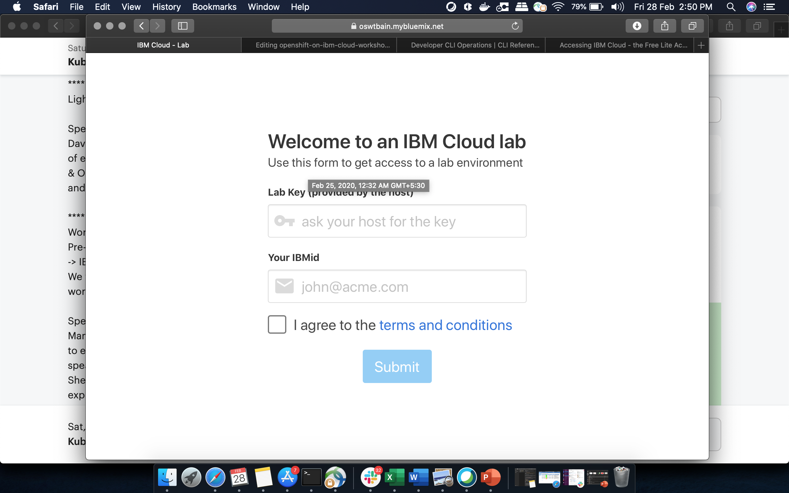
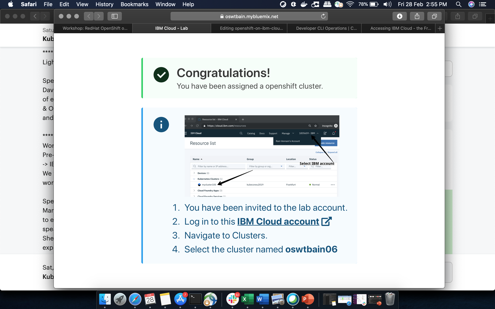
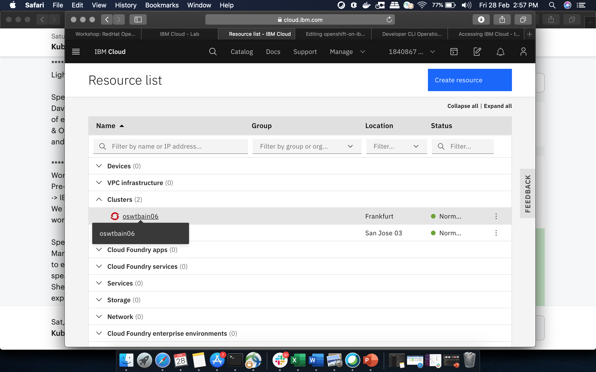
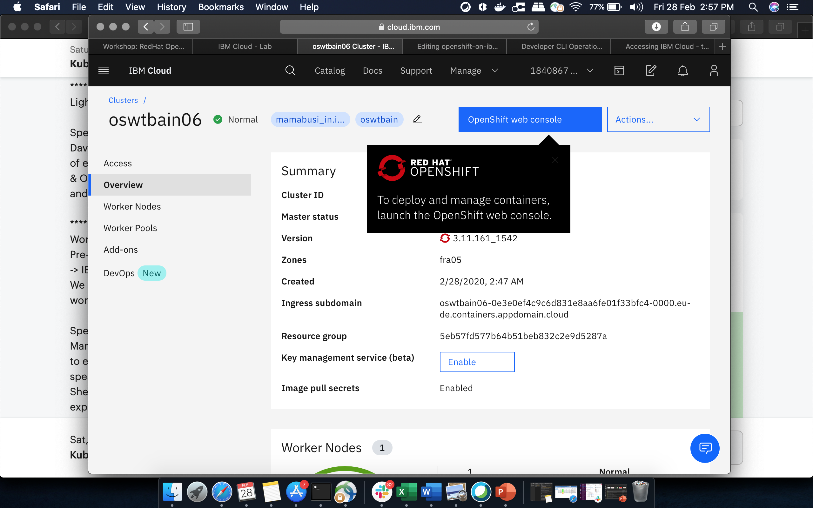
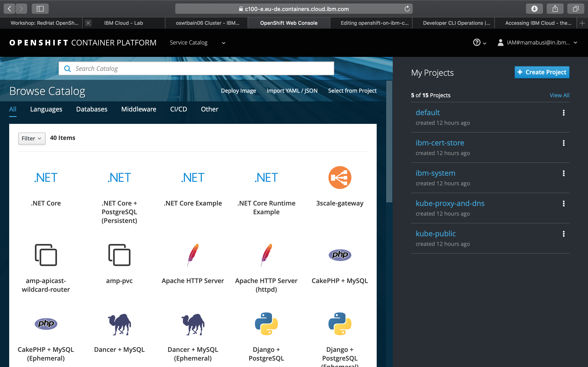

### Access to the IBM Cloud

An IBM Cloud account is needed. [Register](http://bit.ly/OSworkshop2) if you do not have one.

### Access to the OpenShift cluster

We will use the pre-provisioned Openshift cluster on IBM Cloud in this hands-on workshop.

[Login](https://oswtbain.mybluemix.net) with your registered email id used for IBM Cloud account and enter lab key as: **oslab**


  
Login to IBM Cloud and access the cluster


  
  
Click on the cluster:

  
 
Open the **OpenShift web console**



This is the OpenShift Web Console


### Get our access token for the 'oc' CLI. 

From the dropdown menu in the upper right of the console page, click 'Copy Login Command'. 


### Access the Cloud shell (command prompt)
1. You will need the [Cloud shell](https://shell.cloud.ibm.com/) to connect to the OpenShift cluster via command prompt.

Paste the copied access token command into your terminal.

Verify 'oc' CLI

```
$ oc login https://c100-e.eu-de.containers.cloud.ibm.com:32177 --token=xxxxxx'
$ oc projects
```

2. Verify 'kubectl' CLI

```
$ kubectl get pods
```
---

Go back to lab 1. Build and Save the container image' in ['Step 1'](./4-openshift.md#step-1-create-an-open-shift-project)

